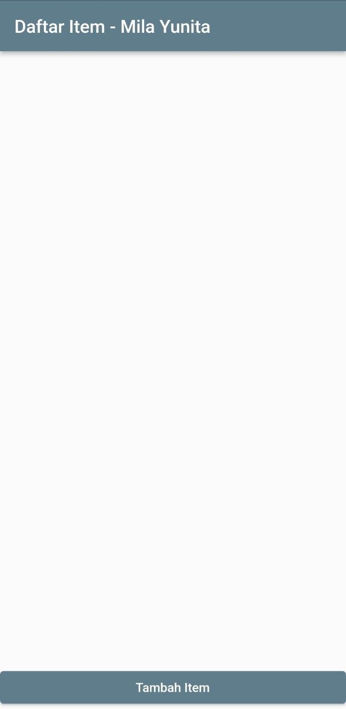
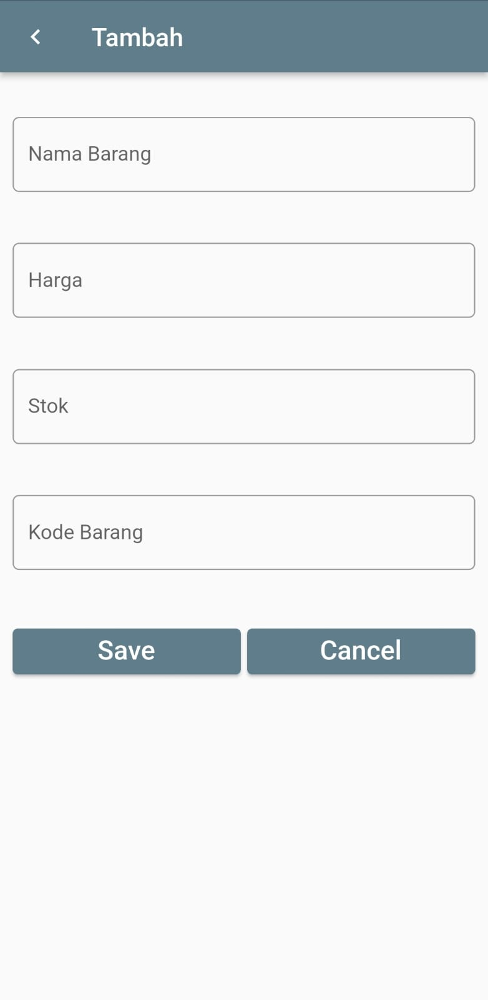
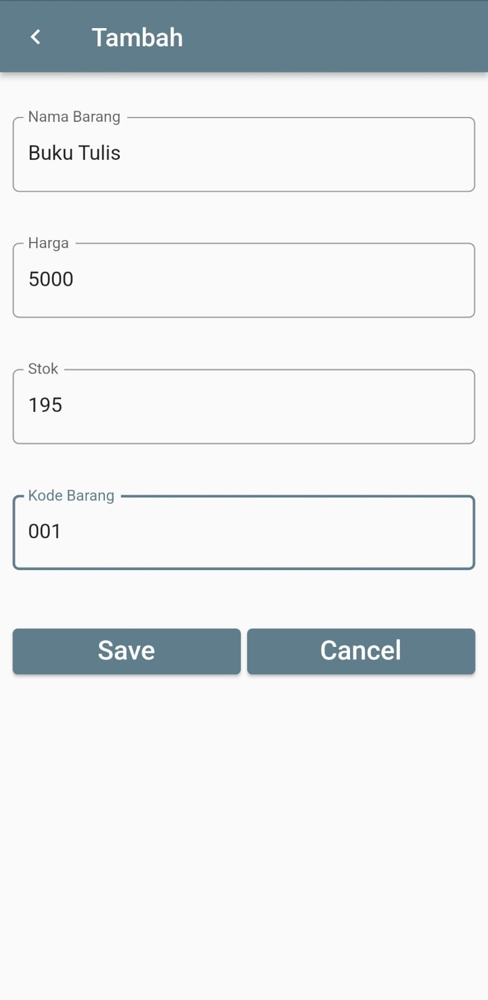
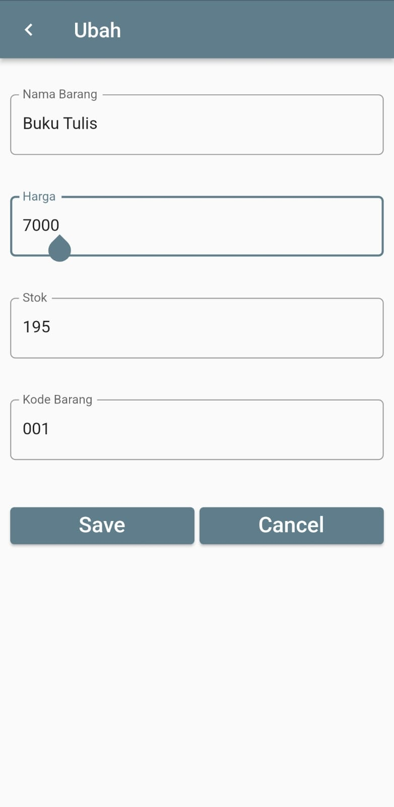
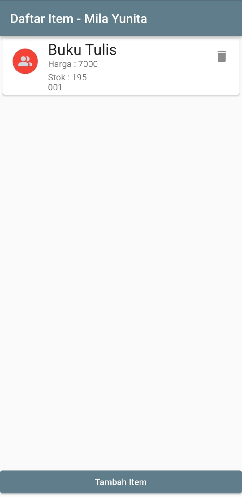
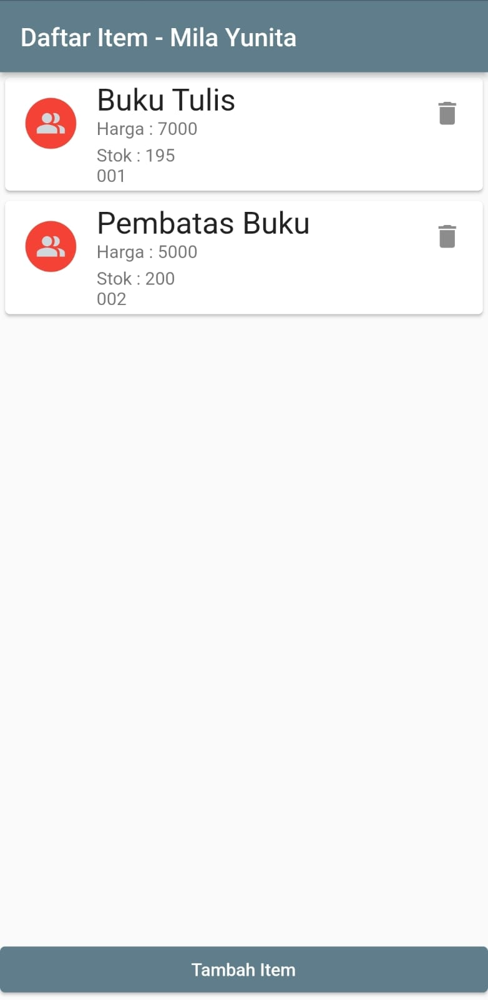

# TUGAS SQLFLITE

NAMA : MILA YUNITA  
KELAS/ABSEN : TI-3C/13  
MATA KULIAH : PEMOGRAMAN MOBILE

## HASIL OUTPUT
1. Tampilan Awal Aplikasi  
    
2. Tampilan ketika mengklik tombol "Tambah Item"  
    
3. Melakukan tambah data, kemudian mengklik tombol Save.  
    
4. Data berhasil ditambahkan.  
    
5. Melakukan Edit data dengan mengubah harga buku tulis yang semula 5000 menjadi 7000.  
    
6. Harga buku tulis berubah menjadi 7000.  
    
7. Melakukan hapus data. Pertama, menambahkan data baru bernama Pembatas Buku, kemudian menghapusnya dengan menkan ikon delete pada data Pembatas Buku. 
    
8 Data Pembatas Buku berhasil dihapus.  
    